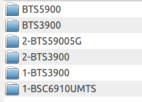
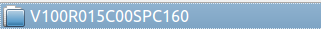
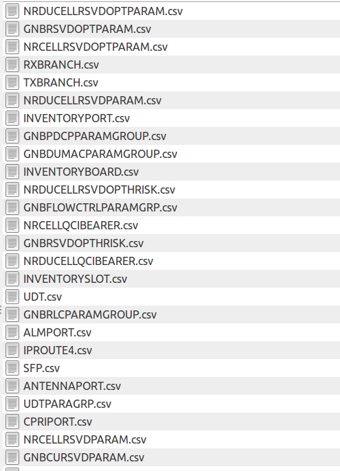
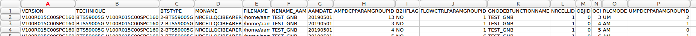

# Simple Summary
This set of scripts is used to export the 2G/3G/4G/5G Dumps from Huawei xml files
The XML files are exported by U2000/U2020 on the ftp paths automatically

There are three types of xml files supported for parsing the xml
- AUTOBAK Files : These are usually placed at /ftproot/BTSTYPEXXX/Data folders
- GExport XML : These are inside the /opt/oss/server/var/fileint/cm/GExport folders with the name like GExport_NENAME_IPADDRESS_TIMESTAMP.xml.gz
- NE GExport XML : These are inside the /opt/oss/server/var/fileint/cm/GExport but are in Folders like NE1231. These folders contain files named like ALL_NENAME_TIMESTAMP.xml.gz

You can use any of these files for parsing or all of them together.

# Dependencies : 
* Qt5 has to be installed if you want to use the GUI. (Check https://www.qt.io/download and download the Opensource version)
For main.py the QT5 dependency is irrelevant 
* Mongo DB should be installed if you need support for inserting tables to Mongo / exporting from Mongo. It is recommended to get this free DB server (https://www.mongodb.com/what-is-mongodb)

* pip install pandas
* pip install lxml
* pip install pymongo
* pip install PyQt5
* pip install pysftp


# Example Export Images :
### Directories Created are based on the combination of files parsed. Any XML files (combination of 2G to 5G can be present).



### Second level is the folder name using the Software version of the NE in question.




### Third level is the file names using MOs



### A Sample export file opened in Spreadsheet editor



# Usage :

### Alpha version : GUI Based
With all dependencies installed, run python main_gui.py and select options as per the below documentation. The GUI is still in alpha stages so you can always use the scripting approach in main.py

GUI requires Qt5 installation as well.

### Summarized Version (CLI based)
#### Configure your directories in the file config.py and then run main.py

### Long Version (CLI based)
#### Go through the parameter meaning in main.py (read through the comments) and then modify as per your requirement. The logs will be generated in the folder so that you can upload in case of any issues.

Just go through the file named main.py and change the settings as per the comments mentioned

All the configurations are in the config.py file. So if you update the values there, then you should be fine

Broadly speaking there are 3 scripts and you can choose to run any OR all of them
* Step 1 is just setting up a logging function. So no need to do anything

* Step 2 (Script to download autobak xml files) - This will download the autobak files if you have specified the FTP server IPs and user/pwd settings
If you dont need to download the files, then just comment out the lines under Step 2

* Step 3 (Script for Actual Parsing of all valid xml files) - You just need to specify if you want to export results to CSV and if you also want to import results into Mongodb. Also specify where to export and import the files from.

* Step 4 (This is just a helper utility to export tables from Mongo DB) - If you need some tables to be exported from MongoDB (if you had inserted the tables at anytime) then you can use this utility function. Just comment step 4 if not needed by you.

### Detailed comments from the section of config.py for custom configuraitons

```python
########################################################################################################################
# Configuration file for constants
########################################################################################################################

DATE_TO_PROCESS = "20190522" #If you want to use the latest DATES from the xml file to be processed automatically then
                            # set this to DATE_TO_PROCESS = ""

########################################################################################################################

HOST_LIST = [["10.200.163.7", "ftpuser", "PWD1"], #These are the FTP servers from where you want to download the AUTOBAK
             ["10.200.163.15", "ftpuser", "PWD2"], # files
             ["10.200.163.230", "ftpuser", "PWD3"]]
########################################################################################################################

LOCALFOLDER = "/home/aamhabiby/Desktop/resources/MIXEDSET" #This is the folder where you want the files to be read from.

EXPORT_PATH = "/home/aamhabiby/Desktop/resources/" # This is the path where you want to export the CSV files (If the CSV export option is enabled)

ZIP_EXPORT_PATH = "/home/aamhabiby/Desktop/resources/" #This is the path where you want to compress all the CSV files and export as single archive

FOL_LIST = ["BTS3900", "BTS3900 LTE", "BTS5900 5G", "BTS5900 LTE", "PICO BTS3900", "DBS3900 IBS", "MICRO BTS3900"] #These are the folder names on the FTP servers where you have the XML files.

loc_7z = '7z' #This is the command to run 7z. On a windows system this would be like "C:\\Program Files\\7z\\7z.exe" etc.

########################################################################################################################
########################################################################################################################
DOWNLOAD_FILES_FROM_FTP = False  # If set to true, then we will attempt to download the files (AUTOBAKDATA files)
PARSE_FILES = True  # If set to true then we will parse the files present in the LOCALFOLDER variable. All type of Huawei XML will be processed
EXPORT_TO_CSV = True  # CAUTION, if you have a lot of files in
                        # the LOCAL FOLDER For parsing then this option is PAINFULLY SLOW
                        # Only use this optino if the number of files to process is low.
########################################################################################################################
########################################################################################################################

EXPORT_TO_MONGO = False  # It is preferred to load all files in Mongo as you can then perform Consistency checks, Parameter Change tracking etc etc

EXPORT_FILES_FROM_MONGO = False  # If set to True, then we will attempt to export
# the selected tables from the Mongo DB into an Excel file
# The variabls are below

TABLES_TO_EXPORT = ["TZ", "UCELL"]  # These tables should be exported from MOngo DB to an excel file
EXPORT_FROM_DB = "1-BTS3900"  # This is the database name from which we want to export the above tables
EXPORT_ALL_DATES = False  # Should we export all available dates in MOngo OR only the latest

########################################################################################################################
```

# Help to grow
Please report back any issues encountered. Any new type of files you would like this tool to process and any other suggestions for improvements.

aliasgherman@gmail.com
