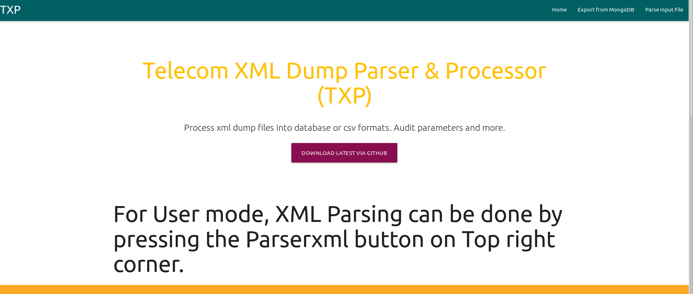
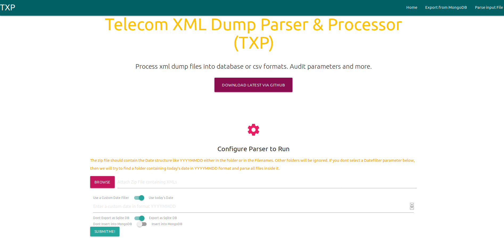
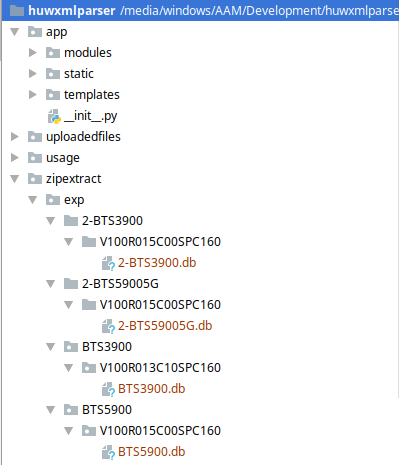

# Installation Instruction

### No admin rights needed

* Download and Install Anaconda from <https://www.anaconda.com/distribution/> The installation will be for the current user so no root/admin rights needed
* On Windows, Goto Start -> Run 'Anaconda Command Prompt'. For Other OS, just open the terminal.
* Now you are inside a python environment created by conda (default name is base)
* Enter the below commands in this terminal\
* conda install flask
* conda install pandas
* conda install pymongo
* conda install lxml
* conda install xlsxwriter
* conda install git
* NOTE DOWN THE CURRENT DIRECTORY
* git clone https://github.com/aliasgherman/huwXMLparser

The exports can be done as a Sqlite3 db file or inserted in a MongoDB server (if you have it installed). So you should also download and install the Sqlite DB Browser (again, no admin rights needed)
* Download Sqlite DB Browser <https://sqlitebrowser.org/dl> (Download the no install zip file)

Till now you have got the scripts downloaded and dependencies resolved. Proceed to the Running section below to understand how to run

Thats all for installation

# Running the Parser

There are two possible running configurations. (Both can be done simultaneously as well)

* Automatic Mode (Run as a script to process files every day/week etc automatically)
* User Mode (You can process files as per your wish using a Modern Browser)

Usage instruction for both modes is given below

#### Automatic Mode (For automated scripts running at a defined time)

* Open the config.py file
* Configure the parameters (Full description is provided inside the file)
* Now you can run python main.py which will run as per the configured parameters and finish when done. No user interaction is needed

### Manual Mode (Using a Modern Browser)

* Open the Anaconda Prompt (See instructions on top if you dont know how)
* Goto the directory where you downloaded the repo (like cd E:\mydir\huwXMLparser\)
* type python run.py and press enter
* Open Firefox/Chrome/Edge and goto localhost:5000

* Click on the top right corner : "Parse Input File"

**Prepare your dump files. Only requirement is to compile all your downloaded files as a zip archive**

[WARNING] Please donot extract the files or change the directory structures. Just combine your folder containing the dump files into a zip archive

* So you now have a zip file containing the dump files. (or folders or subdirectory)
* Click Browse and select this zip file
* On the option below, if your file contains Filenames with today's date (like 20190522 etc.) then no need to change anything
* If you are processing older dumps, then turn the switch to **Use Custom date** and enter a date below like **YYYYMMDD**
* If you want to export files as SQL DB then no need to change the next switch
* If you want to import the dumps in Mongo DB server then change the next switch
* **Press Submit**. This will start the parser

* The exported files will be in the folder where you downloaded the git repo. Example **(huwXMLparser/zipextract/exp)**

* Thats all folks!

# Simple Summary
This set of scripts is used to export the 2G/3G/4G/5G Dumps from Huawei xml files
The XML files are exported by U2000/U2020 on the ftp paths automatically

There are three types of xml files supported for parsing the xml
- AUTOBAK Files : These are usually placed at /ftproot/BTSTYPEXXX/Data folders
- GExport XML : These are inside the /opt/oss/server/var/fileint/cm/GExport folders with the name like GExport_NENAME_IPADDRESS_TIMESTAMP.xml.gz
- NE GExport XML : These are inside the /opt/oss/server/var/fileint/cm/GExport but are in Folders like NE1231. These folders contain files named like ALL_NENAME_TIMESTAMP.xml.gz

You can use any of these files for parsing or all of them together.

# Help to grow
Please report back any issues encountered. Any new type of files you would like this tool to process and any other suggestions for improvements.

aliasgherman@gmail.com
